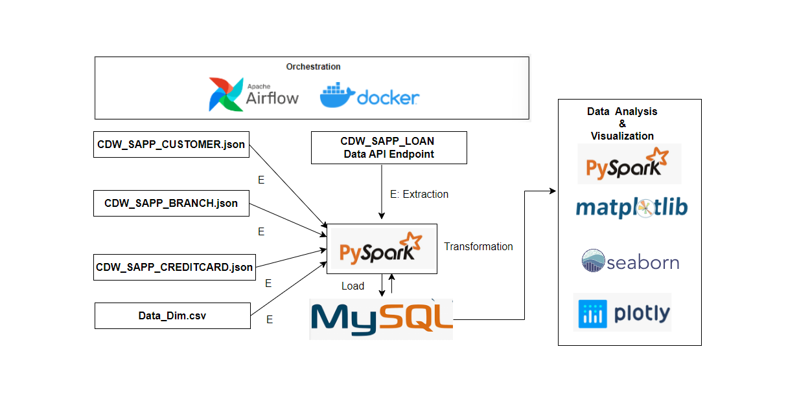

# Credit Card System
## Overview

This capstone project demonstrates an ETL process for a Loan Application dataset and a Credit Card dataset using technologies such as Python advanced modules such as Pandas and Matplotlib, SQL, Apache Spark (Spark Core, Spark SQL), and Visualization libraries such as seaborn and Plotly and Orchestration of ETL pipeline using Airflow and Docker.

 

## Credit Card Dataset Overview

The Credit Card System database is an independent system developed for managing activities such as registering new customers and approving or canceling requests, etc., using the architecture.
A credit card is issued to users to enact the payment system. It allows the cardholder to access financial services in exchange for the holder's promise to pay for them later. Below are three files that contain the customer’s transaction information and inventories in the credit card information.
- CDW_SAPP_CUSTOMER.JSON: This file has the existing customer details.
- CDW_SAPP_CREDITCARD.JSON: This file contains all credit card transaction information.
- CDW_SAPP_BRANCH.JSON: Each branch’s information and details are recorded in this file.

## ETL process:

- Create a virtual enviroment and install necessary libraries. 
- Inorder to automate the process of ETL pipeline,I used Airflow. For Airflow installation, docker-compose.yaml is used.
- curl -LfO 'https://airflow.apache.org/docs/apache-airflow/2.6.2/docker-compose.yaml'
- It needs folders for dags, logs, plugins and config. (mkdir -p ./dags ./logs ./plugins ./config)
- After installation, Airflow can be started using 'docker compose up airflow-init' and Airflow webserver is available at http://localhost:8080.
- Downloaded the input json files in my local directory and reading and performing transformations(includes formatting the data and transforming them into specified data types as in mapping document) using pyspark. Eventhough the files are small I used Pyspark to showcase my knowledge on it.
- In this project , I used MYSQL as my backend and created 'creditcard_capstone' as my database and 'CDW_SAPP_BRANCH','CDW_SAPP_CREDIT_CARD','CDW_SAPP_CUSTOMER' tables for the data to be loaded into them. 
- Also created a Date Dimension table to perform analysis based on days, months and years.
Finally created a primary key and Foreign key to perform query optimization and to reduce redundancies.
    - ALTER TABLE cdw_sapp_customer ADD PRIMARY KEY (SSN);
    - ALTER TABLE cdw_sapp_branch ADD PRIMARY KEY (BRANCH_CODE);
    - ALTER TABLE cdw_sapp_credit_card ADD PRIMARY KEY (TRANSACTION_ID);
    - ALTER TABLE Date_Dim ADD PRIMARY KEY (Date_Id);

    - ALTER TABLE `cdw_sapp_credit_card` ADD FOREIGN KEY (CUST_SSN) REFERENCES cdw_sapp_customer(SSN);
    - ALTER TABLE `cdw_sapp_credit_card` ADD FOREIGN KEY (BRANCH_CODE) REFERENCES cdw_sapp_branch(BRANCH_CODE);
    - ALTER TABLE `cdw_sapp_credit_card` ADD FOREIGN KEY (TIMEID) REFERENCES Date_Dim(Date_Id);

- After Airflow installation is done, I need to integrate the Airflow with MYSQL which is in my localsystem. Since my code is all written in Pyspark, docker needs some installations and files. 
- I used Dockerfile for installations required for my code and built it using 'docker build . --tag extending_airflow:latest' and renaming the docker-compose.yaml image: ${AIRFLOW_IMAGE_NAME:-extending_airflow:latest}.
- In Airflow UI, I created a connection to my local MYSQL specifying 'host.docker.internal' as my host. 
- To Initiate the Airflow webserver 'docker compose up airflow-init' and finally to start the webserver 'docker compose up'.
In order to analyse the data, the following details are observed by querying database.

### Transaction Details Module

1)    To display the transactions made by customers living in a given zip code for a given month and year. Order by day in descending order.
2)    To display the number and total values of transactions for a given type.
3)    To display the total number and total values of transactions for branches in a given state.

### Customer Details Module

1) To check the existing account details of a customer.
2) Used to modify the existing account details of a customer.
3) Used to generate a monthly bill for a credit card number for a given month and year.
4) Used to display the transactions made by a customer between two dates. Order by year, month, and day in descending order.

The code for above steps can be seen in EDA.py

## Visualizations:

- plot the transaction type has a high rate of transactions.
    
- plot state that has a high number of customers.
    
- plot the sum of all transactions for the top 10 customers, and which customer has the highest transaction amount.
    
- plot the percentage of applications approved for self-employed applicants.
    
- plot the percentage of rejection for married male applicants.
    
- plot the top three months with the largest transaction data.
    
- plot which branch processed the highest total dollar value of healthcare transaction.
    

